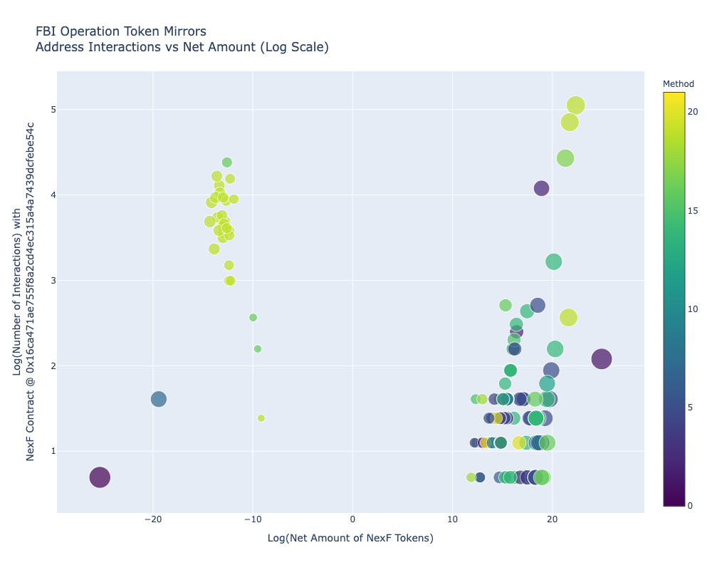
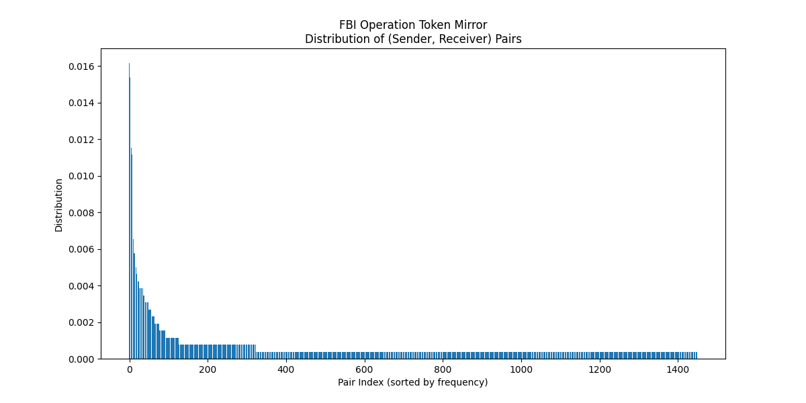
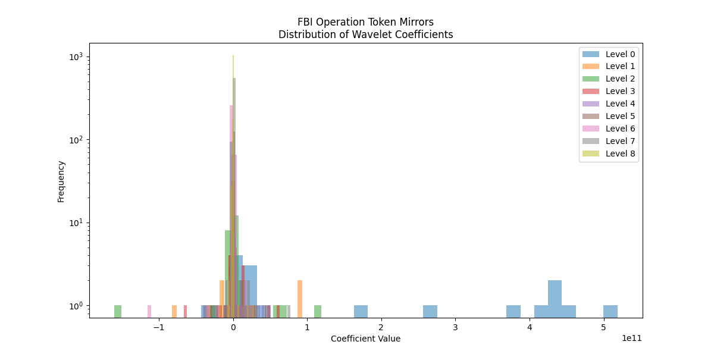
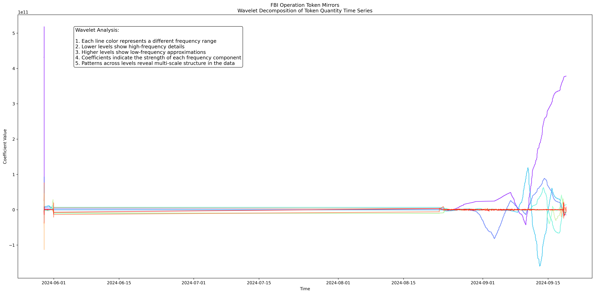

# Operation Token Mirrors: A Data Science Exploration of an FBI Investigation

This repository contains a comprehensive data science exploration of the FBI's "Operation Token Mirrors" by investigating cryptocurrency transactions and their underlying patterns. In an unprecented move, the FBI created a sting website [NexFundAI](https://nexfundai.com/) and Solidity smart contract ([0x16ca471ae755f8a2cd4ec315a4a7439dcfebe54c](https://etherscan.io/search?f=0&q=0x16ca471ae755f8a2cd4ec315a4a7439dcfebe54c)) to mint tokens. The sting operation lasted for three months and twenty days at which point the FBI 'rug pulled' the participants and terminated the token.

This ongoing research informs my next book _Making New Money: How Autonomous Organizations Produce and Govern Cryptocurrencies._ The analysis leverages statistical methods, time-series analysis, and wavelet decomposition to uncover insights into transaction behaviors, address interactions, and network dynamics.

---

## Overview

The dataset used in this project includes transaction data from the Ethereum blockchain (from Etherscan), focusing on the NexF token contract (`0x16ca471ae755f8a2cd4ec315a4a7439dcfebe54c`). This repository provides an in-depth analysis of address interactions, transaction patterns, and statistical summaries.

### Key Files:
- **`LICENSE`**: License information for the repository.
- **`README.md`**: This documentation file.
- **`address_interactions.html`**: Interactive visualization of address interactions.
- **`address_statistics.csv`**: Address-level statistics including net amounts and interactions.
- **`contract_methods_distribution.png`**: Distribution of contract methods used in transactions.
- **`daily_net_amount.csv`**: Daily net amount statistics.
- **`daily_transactions.csv`**: Daily transaction counts.
- **`early_addresses.csv`**: Early participant addresses in the network.
- **`export-0x16ca471ae755f8a2cd4ec315a4a7439dcfebe54c.csv`**: Raw transaction data for the NexF token contract.
- **`fbi_token_mirrors.ipynb`**: Jupyter Notebook containing the full analysis workflow.
- **`pair_distribution.png`**: Visualization of pairwise transaction distributions.
- **`wavelet_coefficient_distribution_log_scale.png`**: Wavelet coefficient distribution (log scale).
- **`wavelet_decomposition_db4_level8.png`**: Wavelet decomposition visualization.

### Narrative Summary:
0x72Ad95C3B65A0da6826b336C104a929D1e676bF3 created contract 0x16ca471ae755f8a2cd4ec315a4a7439dcfebe54c at 2024-05-29 21:05:47 and then created the NexF token 29 minutes later. This contract appears to have been largely copied from an existing contract but includes numerous methods, including the ability to unilaterally remove liquidity from the Uniswap pool and stop trading.

The contract funder also created a NexF to Wrapped Ether (WETH) contact on Uniswap (0x19e7Fe8CC2E813589Ce70CF48207e0D50a911d7a), which participants used extensively.

The contract funder appears to have posted the contract address to a Telegram channel where 647 addresses interacted with it. Many of the interactions were initated using Telegram bots (such as Banana Gun and Maestro) and occured very rapidly (within seconds). Many addresses contain associated ENS records and can be easily identified (see early_addresses.csv, which includes a link to the Twitter page of a notable crypto trader).

---

## Results and Findings

### Statistical Summary
The analysis reveals key insights into the network's structure and behavior:
- **Total Addresses**: 647
- **Total NetAmount**: -3,979,884,068.68
- **Average NetAmount**: -6,151,289.13
- **Total Interactions**: 3,010
- **Average Interactions per Address**: 4.65
- **Unique Methods Used**: 22
- **Average Interaction Duration**: 5 days, 1 hour, 6 minutes
- **Median Interaction Duration**: 10 minutes, 48 seconds

### Address Interactions vs. Net Amount

This visualization examines the relationship between the **contract method used** (represented by the colormap of the nodes), the **log-transformed number of interactions** with the contract, and the **net token balance** for each address.

- **Addresses to the left of the origin (negative values)**: These represent participants who experienced a net loss in tokens. This corresponds to users who were affected by the FBI's "rug pull" operation, who lost their NexF tokens as well as the tokens used in the purchase.
- **Addresses to the right of the origin (positive values)**: These are participants who profited by earning token value. Most of these "winners" created WETH tokens using the Uniswap contract and sold them before the "rug pull" occurred.

The size of each node reflects the magnitude of the net token amount, while the color indicates the specific contract method used in transactions.

  
*Figure*: Visualization of address interactions vs. net token amounts, highlighting winners and losers in Operation Token Mirrors.

For a more detailed exploration, view the [interactive visualization here](https://quinndupont.github.io/Operation_Token_Mirrors/).

### Pairwise Transaction Analysis
The total number of unique `(To, From)` pairs is 1,449. Below are the top 10 most frequent pairs:
| Pair | Distribution | Count |
|------|--------------|-------|
| ('0xe18159438734295bf8611df8ae91323b992a2bc4', 'WETHContract') | 0.0162 | 42 |
| ('WETHContract', '0x289d4ae72a64ff07cb3d80d5520b55ec04ec2aa9') | 0.0158 | 41 |
| ('0x289d4ae72a64ff07cb3d80d5520b55ec04ec2aa9', 'WETHContract') | 0.0154 | 40 |
| ('WETHContract', '0xe18159438734295bf8611df8ae91323b992a2bc4') | 0.0135 | 35 |
| ('0x1127db41c0dd1ca4a19cc47608bcb111c409f120', 'WETHContract') | 0.0119 | 31 |
| ('WETHContract', '0x1127db41c0dd1ca4a19cc47608bcb111c409f120') | 0.0115 | 30 |
| ('0x8a5d8700dd19488d964d202e87b0cc85704054db', 'WETHContract') | 0.0112 | 29 |
| ('WETHContract', '0x8a5d8700dd19488d964d202e87b0cc85704054db') | 0.0112 | 29 |
| ('WETHContract', '0x76999aed261fc44d04acf027635b96f23eff444e') | 0.0108 | 28 |
| ('0x76999aed261fc44d04acf027635b96f23eff444e', 'WETHContract') | 0.0100 | 26 |

### Wavelet Analysis
Wavelet decomposition was applied to analyze transaction time-series data at multiple scales using a Daubechies wavelet (`db4`) at level 8. This technique helps identify patterns and anomalies in the data.

#### Wavelet Analysis Statistics:
- **Mean**: 21,493,653,078.87
- **Median**: 0.00
- **Standard Deviation**: 36,160,940,177.08
- **Skewness**: -0.0403 (slightly left-skewed)
- **Kurtosis**: 69.0671 (extremely leptokurtic)
- **Max Absolute Value**: 518,528,559,504.52
- **Total Energy**: $$1.40 \times 10^{24}$$

Wavelets represent signals as a combination of localized basis functions at different scales and positions. This allows for a detailed analysis of both high-frequency (short-term) and low-frequency (long-term) components in time-series data.

---

## Visualizations

### Pairwise Transaction Distribution
  
*Figure*: Distribution of pairwise `(To, From)` transactions across the network.

### Wavelet Coefficient Distribution (Log Scale)
  
*Figure*: Log-scaled distribution of wavelet coefficients derived from transaction time-series data.

### Wavelet Decomposition Visualization
  
*Figure*: Wavelet decomposition using Daubechies wavelets (`db4`) at level 8.

---

## Conclusion

This project provides a detailed exploration of blockchain transaction data related to "Operation Token Mirrors." By leveraging statistical analysis and advanced techniques like wavelets, we uncover meaningful patterns in cryptocurrency transactions.
